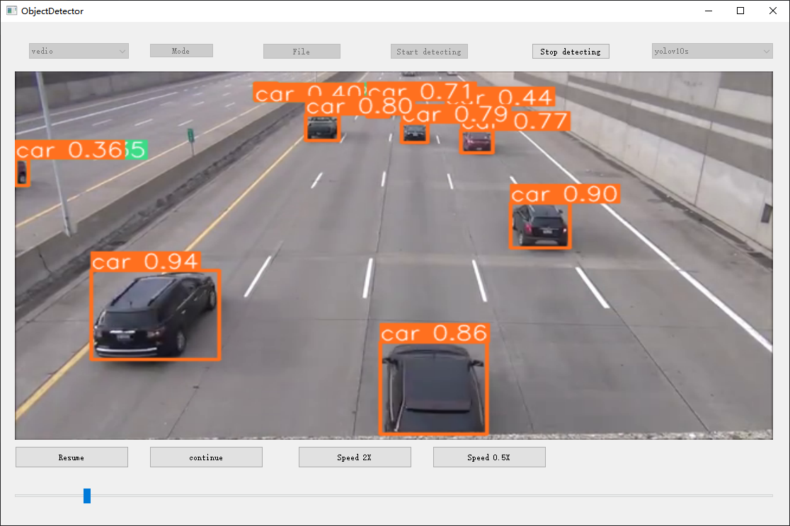

## Object Detector

### Summary

The project is based on YoloV10, environment configuration refer to requirements.txt.

### Function

The detector has three modes, video, camera and picture. Before starting the detection, the user can select the detection model (currently only Yolov10s and Yolov10n are supported). In the video mode, the user can multiply and pause the detected video by clicking the corresponding button. At the same time, the user can adjust the video playback progress by pulling the progress bar below the video.

### Screenshot(s)

### Start this project
python app_detector.py
